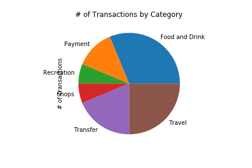
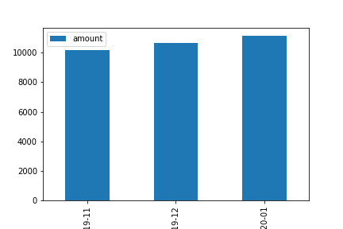
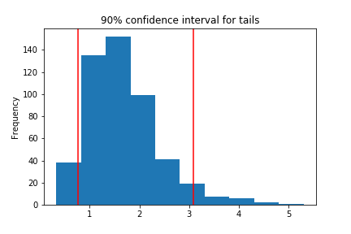
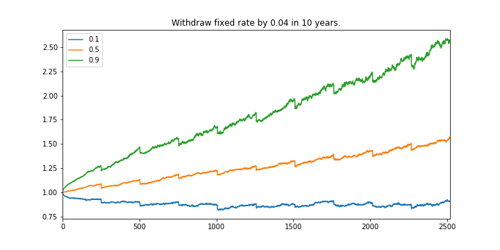
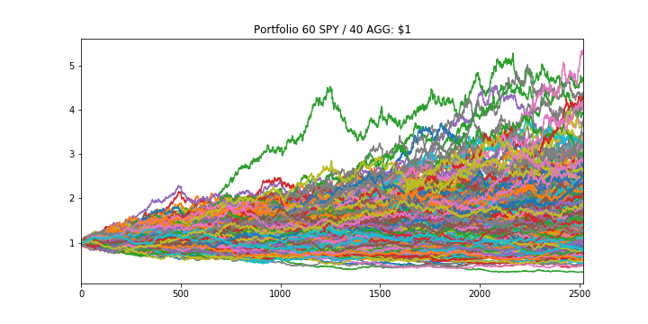

1. Budget Analysis: Summarize the transaction data from the budget analysis and include images for each chart and table produced.
2. Retirement Planning: Summarize the retirement portfolio analysis and include the charts for the Monte Carlo simulation.

